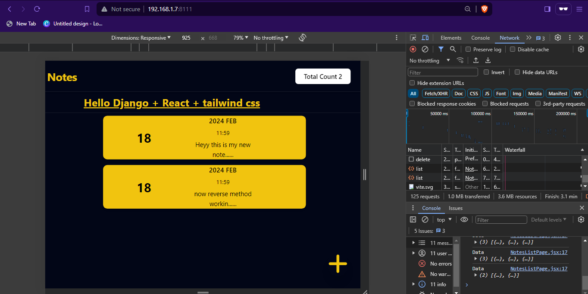
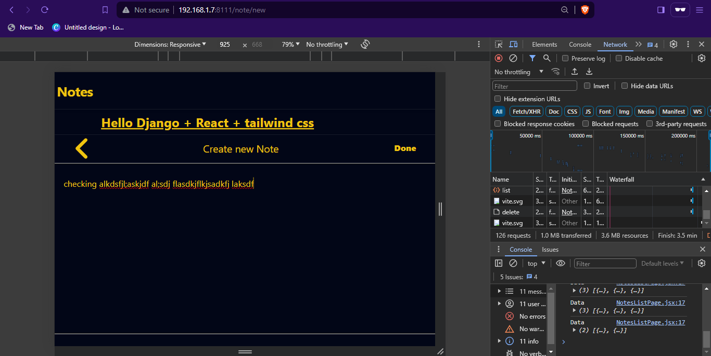
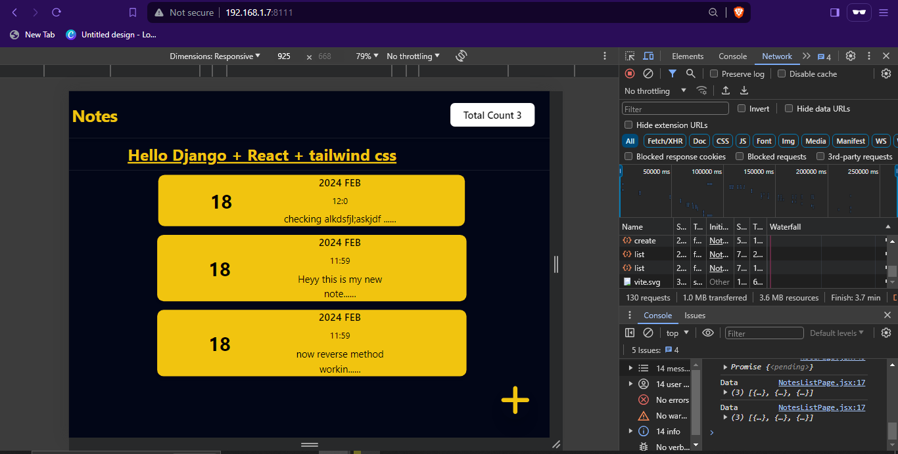

# Django React NotesApp

## Features
- Create Note
- Update Note
- Delete Note
- List Note

### Usage :
For Direct Run
- Single Termial usage
```bash
git clone https://github.com/Roshan-Here/Django-React-NotesApp.git
pip install -r requirments.txt
cd Django-React-NotesApp/backend/
python manage.py runserver 
```
- (To Edit/Customize) Need 2 Terminal

-       Terminal 1 
```bash
git clone https://github.com/Roshan-Here/Django-React-NotesApp.git
pip install -r requirments.txt
cd Django-React-NotesApp/backend/
pip install -r requirments.txt
cd Frontend-Notes
npm install
npm run dev
python manage.py runserver 
```
-       Terminal 2 
```bash
git clone https://github.com/Roshan-Here/Django-React-NotesApp.git
pip install -r requirments.txt
cd Django-React-NotesApp/backend/
pip install -r requirments.txt
python manage.py runserver 
```

### Results 



